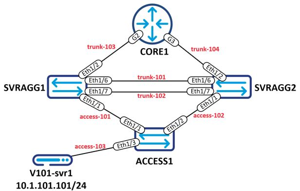

# dcnet-terraform-cisco-vsphere-lab
The purpose of this project is to fill a gap between fully-automated purpose-built network modeling platforms, and manual build-it-yourself virtual labs.

In my experience, network modeling platforms are very easy to use and can build network models quickly, but they can be very buggy and the performance can be less than desirable.

Cisco virtual appliances (Nexus 9Ks, CSR & Cat9K routers, etc) do very well performance-wise running directly on  ESXi, but it can take a significant amount of time to manually build such a lab.


This project attempts to strike a balance between the two. It will deploy a Cisco lab into vSphere using Terraform. It has the following main features/workflows:
1. Create vSphere networking (vSwitches & Port Groups)
1. Deploy network appliance and testing server VMs (Using either OVA or template clones)
1. Optional: Create a SecureCRT lab folder with all routers and switches populated and ready for connection

# SOFTWARE REQUIREMENTS
- **Terraform** (tested on v1.1.0 with vsphere provider v2.0.2)
- **Python 3** (tested on v3.8.10)

    Optional. Not required if you do not use the SecureCRT provisioning feature (see usage notes below).
- **govc** 

    This is used for VM modification (adding serial ports) provisioner scripts
- **Linux** (Tested on Windows10 WSL2 - Ubuntu-20.04)

    Provisioner scripts use bash commands. You can change these to support other operating systems, but as-is the project will only work on Linux platforms.
- **SecureCRT** (Tested on v9.1.0)

    Optional. Not required if you do not use the SecureCRT provisioning feature (see usage notes below).
- **vSphere** (Tested on vCenter v7.0.0 and ESXi v6.7.0)
- **Cisco OVAs**. I have tested creating labs with the following OVAs:
    - Nexus Switch: 9.3.8
    - Catalyst 8000v: 17.06.01a

# PROJECT DIRECTORY STRUCTURE
```
├──ova-repo                             ---Folder for storing OVAs
├──provision_scripts                    ---Folder that holds scripts and templates used during resource provisioning
│  ├──securecrt_session_file.py          ---Python script used to generate SecureCRT session files for each network device
│  └──securecrt_session_template.tpl     ---SecureCRT session INI file used to generate a device-specific session INI file for each network device
├──lab-variables.auto.tfvars            ---Terraform variables file. This is the file that describes/defines the desired lab structure
├──vsphere.tf                           ---Terraform Plan File: Provider configuration and vSphere-related variable definitions
├──datasources.tf                       ---Terraform Plan File: data sources required for resource creation
├──networking.tf                        ---Terraform Plan File: vSphere network configuration
├──VMs.tf                               ---Terraform Plan File: vSphere VM deployment
└──securecrt.tf                         ---Terraform Plan File: SecureCRT modifications
```

# SETTING UP THE ENVIRONMENT
In addition to installing the required software, the following environment configurations must be addressed:

1. The OVA you wish to use for Nexus 9K switches must be copied to the "ova-repo" folder

    Switch deployments use OVA deployment instead of cloning in order to make sure the serial # is unique. This is important for DCNM labs. DCNM will break if all the switches have the same serial #.
1. Routers use (clone) vSphere templates so you must deploy a router OVA, make any default configurations you wish, then convert it to a template.

    **NOTE:** The provisioning script assumes a serial port exists. Make sure to add a network-backed serial port before converting the VM to a template.
1. Create a server template in vSphere. You can use whatever Linux image you want, I personally use [Rocky Linux](https://rockylinux.org/download/). Similar to the router template you will need to create a VM as you normally would. Install the OS, and once the VM is fully configured to your liking, convert it to a template.

    **Note:** The server **MUST** be a Linux VM since we use Linux customization options when performing the template clone operation.
1. Terraform and govc leverage environment variables. The Terraform plans define a variable for vCenter username & password, but the variable is not set in the plan so you will need to set it via environment variable. similarly, govc uses environment variables for vCenter configuration.

    I recommend creating a file in the project folder called environment.env and storing your environment variables there. Here's what mine looks like:
    ```
    # vCenter credentials
    export TF_VAR_vc_user=administrator@vsphere.local
    export TF_VAR_vc_pass=thisisntmyrealpassword

    # GOVC variables
    export GOVC_URL=https://vcenter.ajlab.local
    export GOVC_USERNAME=$TF_VAR_vc_user
    export GOVC_PASSWORD=$TF_VAR_vc_pass
    export GOVC_INSECURE=true
    ```
    Then whenever you start a new shell session you can load the environment variables with: ```source environment.env```
1. Configure a lab management port group in vSphere. This will be assigned to the management ports of Nexus switches and allow you access from your network to lab devices.
1. SecureCRT Session INI template file. Included in the project is a SecureCRT session template file. If you want to use your own file (say to change the color scheme), copy any INI file from your SecureCRT session folder into the "provision_scripts" folder and name it ```securecrt_session_template.tpl```

    The only requirement of the session ini file you copy is it must use **telnet** connectivity.
1. Before you begin configuring the Terraform Plan for your lab, plan it first in Visio.
    You need this step in order to identify the number of links and link types (access ports or trunks) for each of the VMs.

    For each link, note whether it will be access or trunk and give it an ID starting with 101 and incrementing sequentially. Each link ID should be unique, but you can have an access port and a trunk port with the same ID.
    
    **Example:** The Terraform variable file provided would create the following topology-

    

# EXPLORING THE PROJECT VARIABLES FILE
The project variables file, **lab-variables.auto.tfvars** is where you will define how the lab will be created.

### vSphere Config
Standard vSphere configuration parameters. A few notes:
- **esxi_host**: The physical ESXi host where standard vSwitches & associated port groups will be created. This will also be used in the telnet URI of the serial device attached to VMs (see **Lab Switches** and **Lab Routers** sections below).
- **folder**: The folder variable will create a VM folder in the root of your DC with that name where lab VMs will be created. This will also be used in the naming of vSphere network objects. The VM folder will be named as provided, but vSwitches and port groups will replace any whitespace in the lab folder with a dash and force the string to all lowercase. The objects will be prepended with "tf-"

    **Example**: ```folder    = "DCNM Lab"``` may produce a vSphere port group named "tf-dcnm-lab-access-101"

    **Make sure your lab folder is unique so that the Terraform plan doesn't try to create duplicate objects**
- **mgmt_port_grp**: This should be an existing port group in your vSphere environment. The management port of Nexus switches will be attached to this port group. Additionally, it serves as a default port group. Any interfaces set to ```null``` will be attached to this port group and the interface will be disconnected.
### OVAs and Templates
The Nexus switch resource uses an OVA, the router & server resources use templates.

Copy your desired Nexus switch OVA to the ova-repo folder and update the **nexus_switch_ova** variable with the filename of the OVA (do not include the path).

**router_template** & **server_template** should be the name of your router & server vSphere templates respectively.

### SecureCRT
The Terraform Plan has the ability to do the following with SecureCRT:
- Create a lab folder in SecureCRT/Sessions with the same name as your **folder** variable from the vSphere Config section
- Create a telnet session .ini file for all your switches and routers placed in the lab folder

If you do not have SecureCRT or do not wish to have the Terraform Plan modify your SecureCRT sessions, set this to null:

```hcl
securecrt_path = null
```

If you do want the Terraform Plan to modify SecureCRT, provide the path to your SecureCRT folder.

You can get the path by going to Options->Global Options->Configuration Path in SecureCRT

**NOTE**: If you use WSL, you can access your Windows drive from **/mnt/c/**

**WSL Example:** ```securecrt_path = "/mnt/c/users/AJCRUZ/Dropbox/Secure CRT Config"```

### Lab Switches
The **n9ks** variable is a list of switches that defines all the switch VMs you want to deploy.

The switch definition **MUST** be defined in this format:
```hcl
n9ks = [
  {
    name                = "SVRAGG1"
    console_telnet_port = "2001"
    interfaces = {
      eth1 = "access-101"
      eth2 = "trunk-103"
      eth3 = null
      eth4 = null
      eth5 = null
      eth6 = "trunk-101"
      eth7 = "trunk-102"
    }
  },
  {
    name                = "SVRAGG2"
    console_telnet_port = "2002"
    interfaces = {
      eth1 = "access-102"
      eth2 = "trunk-104"
      eth3 = null
      eth4 = null
      eth5 = null
      eth6 = "trunk-101"
      eth7 = "trunk-102"
    }
  },
  {
    name                = "ACCESS1"
    console_telnet_port = "2003"
    interfaces = {
      eth1 = "access-101"
      eth2 = "access-102"
      eth3 = "access-103"
    }
  }
]
```

- **name**: This will be used to create the VM name in vSphere
- **console_telnet_port**: govc will be used to add a network-backed serial device to each switch VM. The serial device will be configured by the govc command as a server with a telnet URI using the ESXi hostname or IP address you supplied in the **vSphere Config** section.

    The serial device's telnet URI will use the format: **telnet://{{esxi_host}}:{{console_telnet_port}}**

    Make sure all your telnet ports are unique and your esxi host is accessible from wherever you will use SecureCRT.
- **interfaces**: There are important constraints and notes you MUST observe and consider when defining the interface map:

    **Constraints:**
    - Interface keys (names) **MUST** use the format **eth{{#}}** and be numbered sequentially starting with 1 as shown in the switch definition example above.
    - **Do not supply real vSphere port groups as the interface values**.

        The Interface value must either be nulll, or use the format **access-{{id}}** for access ports or **trunk-{{id}}** for trunk ports. The IDs need to start with 101.

        If "access-" is used to define the link, the Terraform Plan will create a vSphere port group with a single VLAN ID for use with interfaces that are untagged.

        If "trunk-" is used to define the link, the Terraform Plan will create a vSphere port group with the VLAN ID 4095 (all vlans) for use with interfces that will be in trunk mode and require tagging.

        Interfaces with the same value will be connected to each other. In the switch definition example above, SVRAGG1 port eth1 would be connected to ACCESS1 port eth1 using an access port group. eth1 on the two switches will not use tagging.

    **Notes:**
    - The Terraform Plan logic counts the unique instances of **access-{{id}}** and **trunk-{{id}}** to determine the quantity of each Port Group type to create in vSphere.

    - If the value is ```null``` the Terraform Plan logic will attach to this interface the vSphere Port Group assigned to ```var.mgmt_port_group``` in the **vSphere Config** section **AND** it will configure the VM interfce as disconnected. Here's why this functionality was created:
        - Adding or removing interfaces to the Terraform Plan will cause the VM to be powered down for the operation. I wanted the ability to create unused interfaces that might be used later on without having to power cycle the device.
        - Every interface **MUST** connect to a vSphere Port Group, the OVA deployment process requires it.
        - null interfaces are shut down so they don't appear as directly connected (CDP tables) to every other null interface in the topology. **If you configure this interface in the future you will have to manually connect it in vSphere**
            On that same note, you may want to disable CDP on mgmt0 interfaces so all the switches don't appear connected to each other. This is especially painful in DCNM labs.

    - It is not defined in the lab variables file, but the Terraform Plan logic will automatically create a management0 interface for each switch VM and attach it to the vSphere port group assigned to ```var.mgmt_port_group```

        So there is no need to account for the management port in the interface list, **eth1** in the variable file will be **Ethernet1/1** in the Nexus config and so on.

### Lab Routers
All the same definition structure, constraints, and notes from **Lab Switches** section apply with one exception:

A management port for routers will not automatically be created.

**eth1** in the variable file will map to **GigabitEthernet1** in the Router config and so on.

### Lab Servers
The **servers** variable is a list of servers that defines all the server VMs you want to deploy.

**Note**: The server **MUST** be a Linux VM since we use Linux customization options when performing the template clone operation.

The server definition **must** be defined in this format:
```hcl
servers = [
  {
    name       = "v101-svr1"
    domain     = "ajlab.local"
    eth0       = "access-103"
    eth0_ip    = "10.1.1.101/24"
    gateway_ip = "10.1.1.1"
  }
]
```

- **name**: This will be used to create the VM name in vSphere
- **domain**: An arbitrary domain name to assign to the linux VM. In order to customize linux options on template cloning (for setting the IP address), a hostname & domain name must be supplied.
- **eth0**: The key name (eth0) must not be changed. This assigns the vSphere port group to the VM's network interface. The same constraints and notes from the **Lab Switches** interfaces section applies.